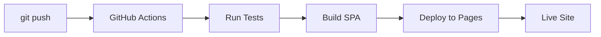

# 🚀 Nexus Portal - GitHub Pages Deployment

## ✅ وضعیت فعلی

پروژه شما یک **SPA خالص** است که روی **GitHub Pages** دیپلوی می‌شود.

- ✅ **Frontend**: کاملاً Client-Side (SPA)
- ✅ **Deployment**: GitHub Actions → GitHub Pages
- ✅ **URL**: `https://mehranjanati.github.io/portal1`
- ❌ **Backend API**: حذف شد (چون GitHub Pages فقط static files)

---

## 📦 ساختار دیپلوی

### Workflow فعال:
- **فایل**: `.github/workflows/deploy.yml`
- **Trigger**: هر push به `main`
- **مراحل**:
  1. Run tests (unit + E2E)
  2. Build SPA (`npm run build` → `build/`)
  3. Deploy به GitHub Pages

### تنظیمات SvelteKit:
```javascript
// svelte.config.js
adapter: adapter({
    pages: 'build',
    assets: 'build',
    fallback: '404.html'
}),
paths: {
    base: '/portal1'  // نام repository شما
}
```

---

## 🔧 تغییرات نسبت به قبل

### ❌ حذف شده:
- `/api/chat` endpoint (نیاز به سرور داشت)
- `adapter-auto` (مخصوص Vercel بود)
- Vercel deployment configs

### ✅ اضافه شده:
- `adapter-static` (برای GitHub Pages)
- Auto-deployment با GitHub Actions
- SPA خالص بدون وابستگی به سرور

---

## 🌐 دسترسی به سایت

بعد از push، سایت شما در این آدرس در دسترس است:

```
https://mehranjanati.github.io/portal1
```

**زمان دیپلوی**: ~2-3 دقیقه بعد از push

---

## 📊 CI/CD Pipeline

### GitHub Actions Workflows:

1. **`deploy.yml`** (اصلی):
   - Run tests
   - Build project
   - Deploy to GitHub Pages
   - **Trigger**: هر push به `main`

2. **`ci.yml`** (اختیاری):
   - فقط تست‌ها
   - بدون دیپلوی
   - **Trigger**: هر push یا PR

---

## 🧪 تست قبل از Push

```bash
# تست local
npm run dev

# بیلد تست
npm run build

# پیش‌نمایش بیلد
npm run preview

# تست E2E
npm run test:e2e
```

---

## 🔄 فرآیند دیپلوی



1. شما: `git push origin main`
2. GitHub Actions: تست‌ها را اجرا می‌کند
3. اگر تست‌ها OK: بیلد می‌کند
4. فایل‌های `build/` را به GitHub Pages آپلود می‌کند
5. سایت در `https://mehranjanati.github.io/portal1` بروز می‌شود

---

## ⚠️ محدودیت‌ها

### چیزهایی که کار **نمی‌کنند**:
- ❌ API endpoints (مثل `/api/chat`)
- ❌ Server-Side Rendering (SSR)
- ❌ Serverless Functions
- ❌ Database connections
- ❌ Environment variables در runtime

### چیزهایی که کار **می‌کنند**:
- ✅ همه UI components
- ✅ Client-side routing
- ✅ Local storage
- ✅ External API calls (از browser)
- ✅ Static assets (images, fonts, etc.)

---

## 🐛 عیب‌یابی

### مشکل: سایت 404 می‌دهد
**راه‌حل**:
1. به Settings → Pages بروید
2. Source را روی "GitHub Actions" بگذارید
3. منتظر بمانید تا workflow اجرا شود

### مشکل: Build failed
**راه‌حل**:
```bash
# Local test
npm run build

# اگر خطا داد، لاگ را بخوانید
```

### مشکل: Tests failed
**راه‌حل**:
```bash
# Run tests locally
npm run test:unit
npm run test:e2e

# Fix errors and push again
```

---

## 📝 یادداشت‌های مهم

1. **Base Path**: همه لینک‌ها باید `/portal1` را در نظر بگیرند
2. **404 Fallback**: برای SPA routing از `404.html` استفاده می‌شود
3. **Auto Deploy**: هر push به `main` = دیپلوی خودکار
4. **Build Time**: ~1-2 دقیقه
5. **Deploy Time**: ~1 دقیقه

---

## 🎯 خلاصه

| مورد | وضعیت |
|------|-------|
| **Platform** | GitHub Pages |
| **Type** | SPA (Static) |
| **Auto Deploy** | ✅ فعال |
| **URL** | `https://mehranjanati.github.io/portal1` |
| **Backend** | ❌ ندارد |
| **Cost** | 🆓 رایگان |

---

🎉 **پروژه شما آماده است!** هر تغییری که push کنید، خودکار روی سایت اعمال می‌شود.
