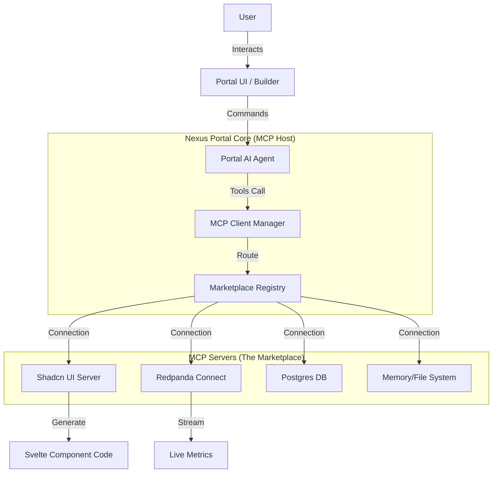

# 🏪 Nexus Portal: MCP Marketplace & Architecture Plan

## 📋 Executive Summary
The **MCP Marketplace** is a core module of the Nexus Portal that transforms the application from a simple management dashboard into a dynamic **Agentic Platform**. By implementing the [Model Context Protocol (MCP)](https://modelcontextprotocol.io/), the Portal allows users to "install" capabilities (MCP Servers) that their AI Agents can use to build UIs, stream data, or interact with external systems.

## 🔗 Core References
1.  **UI Capabilities**: [Shadcn UI MCP](https://ui.shadcn.com/docs/mcp) - Enables the Agent to generate and modify UI components dynamically.
2.  **Data Capabilities**: [Redpanda Connect MCP](https://docs.redpanda.com/redpanda-connect/ai-agents/mcp-server/overview/) - Enables the Agent to stream real-time data and manage pipelines.
3.  **Specification**: MCP JSON-RPC 2.0 (Stdio/SSE Transport).

---

## 🏗️ Architecture: Portal as an MCP Client

The Nexus Portal will act as a **Host (MCP Client)** that manages connections to various **MCP Servers**.

---

## 🧩 The Marketplace UI (User Facing)

The Marketplace will be a visual catalog where users can enabling specific "Skills" for their agent.

### 1. The Storefront (`/marketplace`)
*   **Layout**: Grid view of available MCP Servers (`Card` components).
*   **Categories**: `UI Design`, `Data Streaming`, `DevOps`, `Memory`.
*   **Action**: "Install" / "Connect" button.

### 2. Connection Manager (`/settings/mcp`)
*   **Configuration**: Form to input env vars (API Keys, URLs) for specific servers.
*   **Transport**:
    *   **Local (Dev)**: Connect via `stdio` (requires local backend bridge).
    *   **Remote (Prod)**: Connect via `SSE` (Server-Sent Events) URLs.

---

## 🛠️ Integration Scenarios

### Scenario A: "Build me a Trading Dashboard" (UI Generation)
*   **User Request**: "Create a card showing BTC price."
*   **Agent Action**:
    1.  Consults **Shadcn MCP** to get the `Card` component documentation/code.
    2.  Generates the `shadcn-svelte` code.
    3.  Preview renders via the Portal's internal compiler.

### Scenario B: "Monitor High Value Transactions" (Data Streaming)
*   **User Request**: "Alert me if a transaction > $1M occurs."
*   **Agent Action**:
    1.  Consults **Redpanda MCP** to list available topics.
    2.  Subscribes to the `transactions` stream.
    3.  Sets up a filter logic.

---

## 🚀 Implementation Roadmap

### Phase 1: Foundation (Documentation & UI)
1.  **Create Domain Models**: Define TypeScript interfaces for `McpServer`, `Tool`, `Resource`.
2.  **Build Marketplace UI**:
    *   Use `shadcn-svelte` for the layout.
    *   Use `bits-ui` for complex filtering/dropdowns.
3.  **Mock Registry**: A static JSON list of supported servers (Shadcn, Redpanda).

### Phase 2: Core MCP Client Logic
1.  **SDK Integration**: Integrate the TypeScript MCP SDK (`@modelcontextprotocol/sdk`).
2.  **Transport Layer**: Implement a WebSocket or SSE bridge to allow the browser to talk to backend MCP servers.
3.  **Tool Registration**: Dynamically register MCP tools into the Agent's prompt context.

### Phase 3: The "Builder" Page
1.  Create a "Canvas" or "Terminal" interface.
2.  Allow the Agent to output code directly into the user's project files using the standard `fs` MCP tools (governed by the Portal).

---

## 🎨 Design System Application

We will use our **Hybrid Strategy** (Shadcn + Bits UI) for the Marketplace:

| Feature | Component Source | Component Type |
| :--- | :--- | :--- |
| **Server Card** | `shadcn-svelte` | `Card`, `Badge` (Status) |
| **Search/Filter** | `bits-ui` | `Combobox` (High performance) |
| **Install Modal** | `shadcn-svelte` | `Dialog`, `Form` |
| **Logs/Console** | `bits-ui` | Custom Scroll Area |
| **Connect Button** | `shadcn-svelte` | `Button` (Variants: Outline/Solid) |

---

## 📝 Next Steps (Actionable)

1.  **Skeleton**: Create `src/lib/types/mcp.ts` to define the data structures.
2.  **UI**: Create `src/routes/marketplace/+page.svelte`.
3.  **Mock Data**: Create `src/lib/data/mcp-registry.ts` with "Shadcn UI" and "Redpanda" as the first entries.
